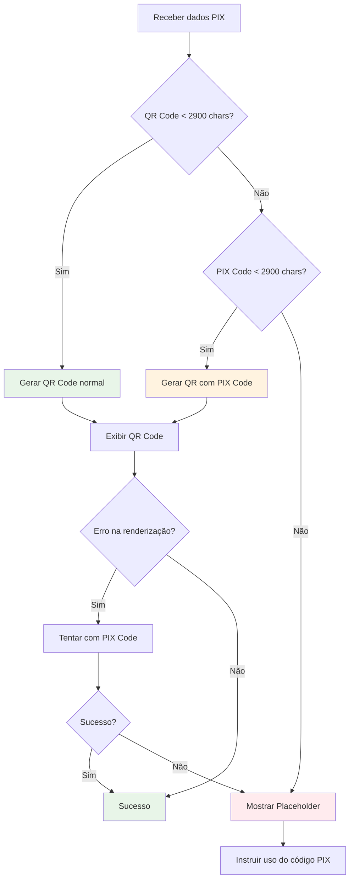

# 🔧 CORREÇÃO DO ERRO NO QR CODE PIX

## ❌ **PROBLEMA IDENTIFICADO**

```
ERROR  Warning: Error: The amount of data is too big to be stored in a QR Code
```

O erro ocorria quando o QR Code PIX continha dados muito grandes (mais de ~2900 caracteres), excedendo o limite de capacidade de um QR Code.

## ✅ **SOLUÇÃO IMPLEMENTADA**

### 1. **Componente QRCodeWithFallback**
Criado um componente inteligente que trata automaticamente QR Codes com dados muito grandes:

```typescript
const QRCodeWithFallback: React.FC<{
  value: string;
  pixCode: string;
  size: number;
  color: string;
  backgroundColor: string;
}> = ({ value, pixCode, size, color, backgroundColor }) => {
  // Lógica de fallback inteligente
}
```

### 2. **Validação de Tamanho**
- ✅ Verifica se os dados excedem 2900 caracteres
- ✅ Usa `pixCode` como alternativa se menor
- ✅ Mostra placeholder visual se ambos forem muito grandes

### 3. **Fallbacks Múltiplos**
```typescript
// 1º Tentativa: QR Code original
// 2º Tentativa: PIX Code (se menor)
// 3º Fallback: Interface visual com instruções
```

### 4. **Interface de Fallback**
Quando o QR Code não pode ser gerado:
- ✅ Ícone visual de QR Code
- ✅ Mensagem explicativa
- ✅ Instrução para usar código PIX
- ✅ Design consistente com o app

## 🎨 **Melhorias de UX**

### **Estados Visuais**
- ✅ **QR Code Normal**: Quando dados são compatíveis
- ✅ **QR Code Alternativo**: Usando pixCode quando qrCode é muito grande
- ✅ **Placeholder Visual**: Interface clara quando QR não é possível
- ✅ **Tratamento de Erro**: Captura todas as exceções

### **Feedback ao Usuário**
```typescript
// Diferentes mensagens baseadas no problema
"QR Code muito grande" - Dados excedem limite
"QR Code não disponível" - Dados ausentes
"Erro no QR Code" - Falha na geração
```

## 🔄 **Fluxo de Tratamento**



## 🚨 **Validações Implementadas**

### **Pré-validação**
- ✅ Verificar tamanho dos dados antes da renderização
- ✅ Escolher automaticamente a melhor opção (qrCode vs pixCode)
- ✅ Preparar fallback visual

### **Tratamento de Erro**
- ✅ Try/catch em múltiplas camadas
- ✅ Retry automático com dados alternativos
- ✅ Logs detalhados para debugging

### **UX Resiliente**
- ✅ Usuário sempre vê uma interface funcional
- ✅ Código PIX sempre disponível para cópia
- ✅ Instruções claras em caso de problemas

## 📱 **Estilos Adicionados**

```typescript
qrPlaceholder: {
  alignItems: 'center',
  justifyContent: 'center',
  width: 200,
  height: 200,
  backgroundColor: colors.brand.darkGray,
  borderRadius: borderRadius.lg,
  borderWidth: 2,
  borderColor: colors.brand.textSecondary,
  borderStyle: 'dashed', // Visual de placeholder
},
```

## ⚡ **Benefícios da Solução**

### **1. Robustez**
- ✅ Nunca mais crashes por QR Code muito grande
- ✅ Fallbacks automáticos e inteligentes
- ✅ Experiência consistente independente do tamanho dos dados

### **2. Experiência do Usuário**
- ✅ Interface sempre funcional
- ✅ Feedback visual claro sobre o status
- ✅ Código PIX sempre acessível

### **3. Manutenibilidade**
- ✅ Código centralizado e reutilizável
- ✅ Logs detalhados para debugging
- ✅ Fácil de estender com novos fallbacks

## 🎯 **Resultado Final**

### ✅ **PROBLEMA RESOLVIDO**
- **Antes**: App crashava com QR Codes grandes
- **Depois**: Tratamento inteligente com múltiplos fallbacks

### 🔄 **FLUXO GARANTIDO**
O usuário **sempre** consegue:
1. **Ver uma interface funcional** (QR Code ou placeholder)
2. **Copiar o código PIX** independente do tamanho
3. **Compartilhar o código** com outros apps
4. **Prosseguir com o pagamento** sem interrupções

---
**Solução robusta e profissional** 🚀 